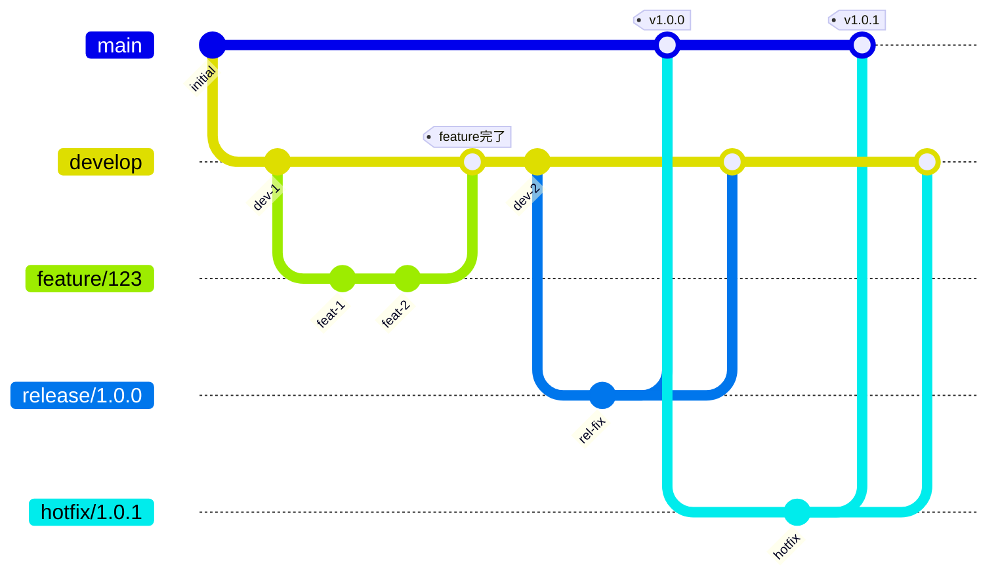
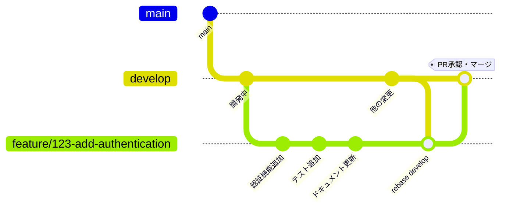
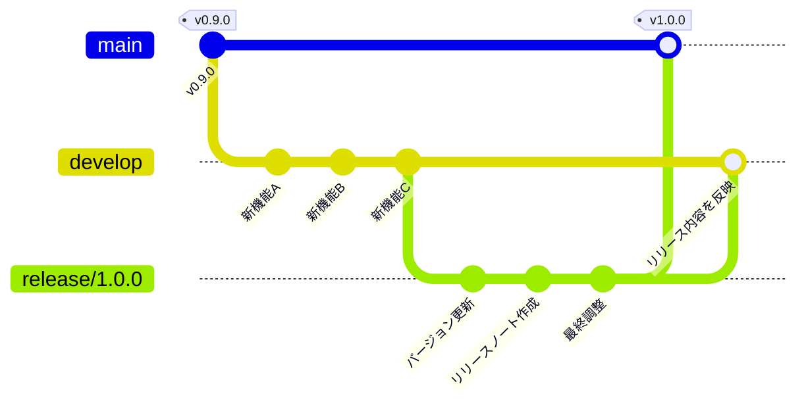
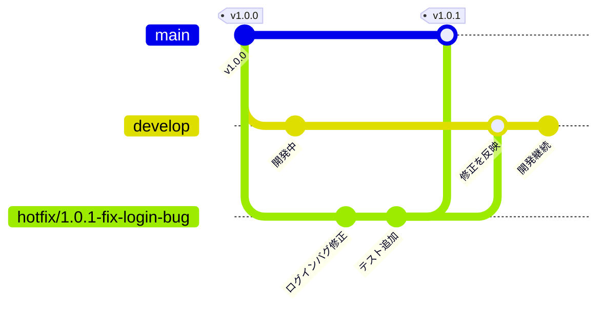

# Git ワークフロー

本プロジェクトでは**Gitflow**をベースとしたブランチ戦略を採用しています。

## 目次

- [ブランチ戦略](#ブランチ戦略)
- [ブランチ命名規則](#ブランチ命名規則)
- [コミットメッセージ規約](#コミットメッセージ規約)
- [Pull Request のルール](#pull-requestのルール)
- [開発フロー](#開発フロー)
- [マージ戦略](#マージ戦略)

## ブランチ戦略

### main ブランチ

- 本番環境にデプロイされるコードを管理
- 常に安定した状態を保つ
- 直接コミットは禁止
- `release`ブランチまたは`hotfix`ブランチからのマージのみ許可
- タグ付けによるバージョン管理を実施

### develop ブランチ

- 開発の中心となるブランチ
- 次のリリースに向けた機能を統合
- `feature`ブランチからのマージを受け入れる
- 直接コミットは原則禁止（緊急の場合を除く）

### feature ブランチ

- 新機能や機能改善を開発するためのブランチ
- `develop`ブランチから分岐
- 開発完了後は`develop`ブランチへマージ
- 開発者のローカル環境またはリモートで管理

### release ブランチ

- リリース準備を行うためのブランチ
- `develop`ブランチから分岐
- バグフィックスやリリースノートの更新を実施
- 完了後は`main`と`develop`の両方にマージ
- `main`へマージ時にバージョンタグを付与

### hotfix ブランチ

- 本番環境の緊急バグ修正用ブランチ
- `main`ブランチから分岐
- 修正完了後は`main`と`develop`の両方にマージ
- `main`へマージ時にパッチバージョンのタグを付与

## ブランチ命名規則

### feature ブランチ

```
feature/<issue-number>-<short-description>
```

**例:**

```
feature/123-add-user-authentication
feature/456-improve-search-performance
```

### release ブランチ

```
release/<version>
```

**例:**

```
release/1.0.0
release/2.1.0
```

### hotfix ブランチ

```
hotfix/<version>-<short-description>
```

**例:**

```
hotfix/1.0.1-fix-login-bug
hotfix/2.1.1-security-patch
```

## コミットメッセージ規約

[Conventional Commits](https://www.conventionalcommits.org/)に準拠します。

### フォーマット

```
<type>(<scope>): <subject>

<body>

<footer>
```

### Type

- `feat`: 新機能
- `fix`: バグ修正
- `docs`: ドキュメントのみの変更
- `style`: コードの動作に影響しない変更（フォーマット、セミコロンの追加など）
- `refactor`: バグ修正や機能追加を含まないコード変更
- `perf`: パフォーマンス向上のための変更
- `test`: テストの追加や修正
- `chore`: ビルドプロセスやツールの変更

### Scope（オプション）

変更の影響範囲を示します。

**例:**

- `auth`: 認証関連
- `ui`: UI 関連
- `api`: API 関連
- `db`: データベース関連

### Subject

- 変更内容を簡潔に記述（50 文字以内を推奨）
- 命令形で記述（例: "add" not "added"）
- 文末にピリオドを付けない

### Body（オプション）

- 変更の詳細な説明
- なぜこの変更が必要か、何を変更したかを記述
- 各行は 72 文字以内を推奨

### Footer（オプション）

- Breaking Changes の記述
- Issue 番号の参照

### コミットメッセージの例

```
feat(auth): ユーザー認証機能を追加

- JWT トークンベースの認証を実装
- ログイン/ログアウト機能を追加
- 認証ガードをルーティングに適用

Closes #123
```

```
fix(ui): ログインフォームのバリデーションエラーを修正

パスワードフィールドが空の場合に適切なエラーメッセージが
表示されない問題を修正しました。

Fixes #456
```

```
refactor(api): ユーザーデータ取得ロジックをリファクタリング

コードの可読性を向上させるため、データ取得ロジックを
別の関数に切り出しました。
```

## Pull Request のルール

### PR 作成前のチェックリスト

- [ ] ローカルでビルドが成功すること
- [ ] テストが全て通ること
- [ ] Lint エラーがないこと
- [ ] 関連するドキュメントを更新していること
- [ ] コミットメッセージが規約に準拠していること

### PR のタイトル

コミットメッセージと同様の形式を使用します。

```
<type>(<scope>): <subject>
```

**例:**

```
feat(auth): ユーザー認証機能を追加
fix(ui): ログインフォームのバリデーションエラーを修正
```

### PR の説明

以下の情報を含めます：

```markdown
## 概要

この変更の目的を簡潔に説明

## 変更内容

- 変更点 1
- 変更点 2
- 変更点 3

## テスト方法

この変更をテストする手順

## スクリーンショット（該当する場合）

UI 変更の場合はスクリーンショットを添付

## 関連 Issue

Closes #123
```

### レビュー要件

- 最低 1 名のレビュー承認が必要
- CI が全て通過していること
- コンフリクトが解消されていること

### レビュー観点

レビュアーは以下の観点でレビューを実施：

- コードが要件を満たしているか
- コーディング規約に準拠しているか
- テストが適切に書かれているか
- パフォーマンスに問題がないか
- セキュリティ上の問題がないか
- 可読性・保守性が高いか

## 開発フロー

### Gitflow 全体像



### 1. 新機能開発



```bash
# 1. developブランチを最新化
git checkout develop
git pull origin develop

# 2. featureブランチを作成
git checkout -b feature/123-add-user-authentication

# 3. 開発作業
# コードを書く、コミットする

# 4. 定期的にdevelopの変更を取り込む
git fetch origin
git rebase origin/develop

# 5. リモートにプッシュ
git push origin feature/123-add-user-authentication

# 6. Pull Requestを作成
# GitHub上でdevelopブランチへのPRを作成

# 7. レビュー後、マージ
# GitHub上でSquash and MergeまたはMerge commit

# 8. ローカルブランチを削除
git checkout develop
git pull origin develop
git branch -d feature/123-add-user-authentication
```

### 2. リリース準備



```bash
# 1. developブランチから分岐
git checkout develop
git pull origin develop
git checkout -b release/1.0.0

# 2. バージョン番号を更新
# package.jsonなどのバージョンを更新

# 3. リリースノートを作成
# CHANGELOG.mdを更新

# 4. バグフィックスがあればコミット
git add .
git commit -m "chore(release): version 1.0.0"

# 5. mainへマージ
git checkout main
git pull origin main
git merge --no-ff release/1.0.0
git tag -a v1.0.0 -m "Release version 1.0.0"
git push origin main --tags

# 6. developへもマージ
git checkout develop
git merge --no-ff release/1.0.0
git push origin develop

# 7. releaseブランチを削除
git branch -d release/1.0.0
git push origin --delete release/1.0.0
```

### 3. 緊急バグ修正（Hotfix）



```bash
# 1. mainブランチから分岐
git checkout main
git pull origin main
git checkout -b hotfix/1.0.1-fix-login-bug

# 2. バグを修正
# コードを修正、テストを追加

# 3. バージョン番号を更新
git add .
git commit -m "fix(auth): ログインバグを修正"

# 4. mainへマージ
git checkout main
git merge --no-ff hotfix/1.0.1-fix-login-bug
git tag -a v1.0.1 -m "Hotfix version 1.0.1"
git push origin main --tags

# 5. developへもマージ
git checkout develop
git merge --no-ff hotfix/1.0.1-fix-login-bug
git push origin develop

# 6. hotfixブランチを削除
git branch -d hotfix/1.0.1-fix-login-bug
git push origin --delete hotfix/1.0.1-fix-login-bug
```

## マージ戦略

### feature → develop

**推奨: Squash and Merge**

- 機能単位で 1 つのコミットにまとめる
- コミット履歴がクリーンに保たれる
- PR のタイトルがコミットメッセージになる

**または: Merge commit**

- 機能開発の詳細な履歴を残したい場合
- `--no-ff`オプションを使用

### release → main / develop

**Merge commit（`--no-ff`）**

- リリースの履歴を明示的に残す
- タグ付けと合わせて使用

### hotfix → main / develop

**Merge commit（`--no-ff`）**

- 緊急修正の履歴を明示的に残す
- タグ付けと合わせて使用

## ベストプラクティス

### コミットの粒度

- 1 つのコミットは 1 つの論理的な変更に留める
- 大きな機能は複数のコミットに分割
- コミットメッセージで何をしたか明確に説明

### ブランチの寿命

- feature ブランチは短命に保つ（数日〜1 週間程度）
- 長期間のブランチは定期的に develop の変更を取り込む
- マージ後は速やかにブランチを削除

### コンフリクトの解決

- 定期的に`develop`の変更を取り込む（`git rebase`）
- コンフリクトは早期に解決
- 不明な点があればチームメンバーに相談

### コードレビュー

- 小さな PR を作成（変更行数は 300 行以内を推奨）
- レビューコメントには建設的に対応
- 質問には丁寧に回答

## トラブルシューティング

### コミットを間違えた場合

```bash
# 直前のコミットを修正
git commit --amend

# 複数のコミットを修正
git rebase -i HEAD~3
```

### プッシュ前にコミットをまとめる

```bash
# 最新3つのコミットをまとめる
git rebase -i HEAD~3

# エディタで'pick'を'squash'に変更
```

### 間違ったブランチにコミットした場合

```bash
# コミットを別ブランチに移動
git checkout correct-branch
git cherry-pick <commit-hash>

# 元のブランチのコミットを取り消し
git checkout wrong-branch
git reset --hard HEAD~1
```

## 参考リンク

- [Gitflow Workflow](https://www.atlassian.com/git/tutorials/comparing-workflows/gitflow-workflow)
- [Conventional Commits](https://www.conventionalcommits.org/)
- [GitHub Flow](https://docs.github.com/en/get-started/quickstart/github-flow)
